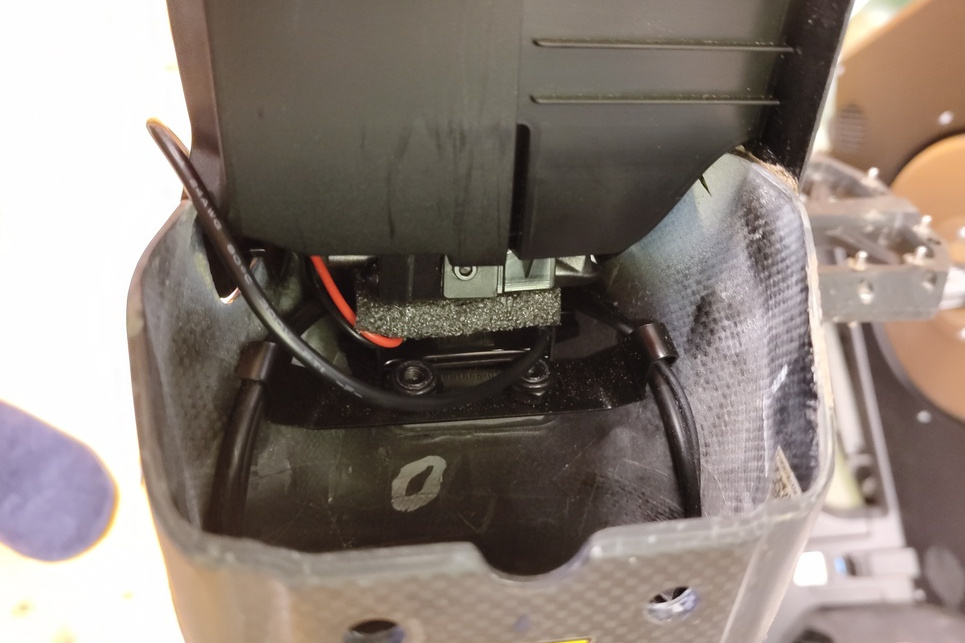

# Shimano E-Tube <!-- omit in toc -->

This is just a collection of stuff found out about the Shimano E-Tube hardware and protocol. This repo by far is not intended to cover everything there is to learn about E-Tube and will only touch the subjects that interest me personally.

**If you like my work please consider [supporting me](https://github.com/Chrismettal#donations)!**

## Table of contents <!-- omit in toc -->

- [Parts / Device under test](#parts--device-under-test)
- [Software](#software)
- [Wiring](#wiring)
    - [Communication / Internal Power](#communication--internal-power)
    - [External power](#external-power)
- [Communication](#communication)
- [Donations](#donations)
- [License](#license)

## Parts / Device under test

|    Part    |                  Name                   |   FCC ID    |
| :--------: | :-------------------------------------: | :---------: |
|    Bike    |      `2023 Canyon Spectral:ON CF7`      |      -      |
|   Motor    |           `Shimano DU-EP801`            |      -      |
|  Computer  |           `Shimano SC-EM800`            | `WY7-SWAN2` |
|  Charger   |             `Canyon BC001`              |      -      |
|   Switch   |          `Shimano SW-EM800-L`           |      -      |
|  Shifter   |                 Passive                 |      -      |
| Derailleur |                 Passive                 |      -      |
|  Tracking  | Some Canyon specific, unlabeled tracker |      -      |

---

## Software 

- Shimano does offer their `E-Tube Professional` software for download [on their website](https://bike.shimano.com/de-DE/e-tube/project/forwindows.html)
- They expect professionals to use their `SM-PCE02` (FCC ID `R-R-WY7-PCE02`) USB to E-Tube device to connect to your bike to pull more data than the app allows

---

## Wiring

### Communication / Internal Power

Low-Power devices like shifters, derailleurs, the bike computer etc are connected through `SD-300` E-Tube wires that carry power and communication at the same time through a 2-Wire interface.

The plug itself looks a lot like longer, straight MCX plugs but not exactly.

Click to expand - Pictues of SD-300 connector

### External power

There are 2 groups of  screw connectors on the EP801 motor, both providing `12 V @ 2 A` power. One of them is labeled `ACC` and is on as long as the bike is on, while the other is labeled `LIGHT` and can be switched on or off by E-Tube switches or through the display.

Additionally, 4 E-Tube ports can be found on the motor to wire up additionall accessories

I wired up a potted 12 V to USB DC-DC converter to the "LIGHT" port and placed it in the frame above the motor, holding it in with a compressed piece of foam.

Click to expand - Images of USB converter installation

**USB converter**

**Wiring at "LIGHT" port**

**Placed converter**

**USB routed outside**

Extremely ugly and not yet fixed in any way, but good for today. (Watch me not change this ever)

---

## Communication

According to [this EEVBlog Forum thread](https://www.eevblog.com/forum/projects/shimano-di2-modulation/) the communication uses Binary Phase Key Shifting (BPSK) to modulate the communication signals (Which SHOULD be `CAN` telegrams according to Shimano documentation) over the E-Tube wires.

I have been able to capture some packets, but didn't yet figure out the actual protocol used here. Getting enough data in high enough resolution into my scope's memory proved a little tricky. Bursts can be somewhat observed with the [translator totebook](/data_analysis/E-Tube_Translator.ipynb) which is semi successful in extracting binary sequences from a raw burst scope. The data I recorded didn't yet make sense to me though. As I don't have a specific motivation to decoding the protocol right now, I am gonna put this on ice for now. (2024-01)

Next steps in figuring this out look as follows:

- [x] Aquire a scope trace of E-Tube communications
- [ ] Decode with Python / Octave
    - [x] PSK to Binary
    - [ ] Recapture "idle burst" in better resolution
    - [ ] Binary to hopefully raw CAN
    - [ ] Raw CAN to useful information
- [ ] Design hardware to automatically decode to USB Serial or logfiles ([Flipper Zero Backpack?](https://github.com/chrismettal/flipper-zero-backpacks))

Click to expand - Communication reverse engineering

- High level overview of E-Tube communication, DC coupled. While the bike is on, there is about 8.5 V DC on the E-Tube wires, with 1 V peak to peak BPSK modulated on top of it. When the bike is off, no communication takes place, and the DC voltage drops to about 7.5 V.
- In idle, about once all 1000ms, a 500ms burst of communication takes place.
- When buttons are pressed, the communication becomes almost constant

- Mid-ish level overview of similar data, AC coupled

---

## Donations

**If you like my work please consider [supporting me](https://github.com/Chrismettal#donations)!**

## License

  This work is licensed under a <a rel="license" href="http://creativecommons.org/licenses/by-sa/4.0/">Creative Commons Attribution-ShareAlike 4.0 International License</a>.
